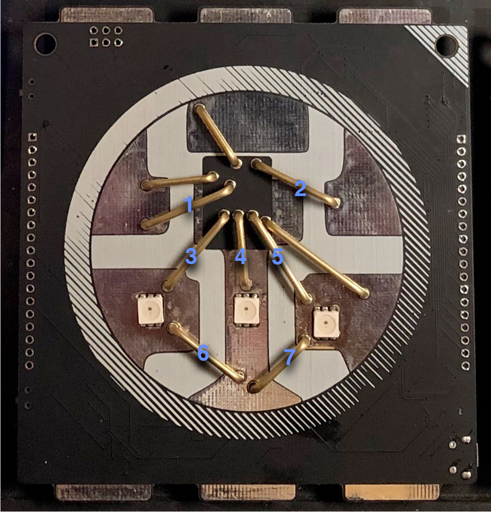

# Pixel Badge 2 - Dark Pixel
by @blinkingthing

## What is it?
Pixel Badge 2 - Dark Pixel is an ESP32 based conference badge that looks like a giant WS2812S.

### Features
* Blinking LEDs
* Touch Controls
* User Defined Colors
* Memory!
* SAO control
* On-board USB -> UART
* Broken out ESP32 pins for devboard fun!
* Daisy-chainable with compatible WS2812 LEDs
* *Cool* art!
* Lanyard holes (attach it to something!)

### What does it do
Pixel Badge 2 has three LEDs with pre-programmed animations that can be altered to use custom colors. The brass 'bond-wires' are touch sensitive inputs that can change the animations, colors, and save and reload default color settings from memory. All pins on the ESP32 are broken out so this can be used as a dev board. There are WS2812 compatible data inputs and outputs so this board can either be chained into an existing chain of LEDs, or output data to a chain of compatible LEDs. The board has on-board USB -> Serial and can be programmed with Arduino directly through it's micro USB port. It also has a li-po charging circuit that can charge a 3.7v li-po battery via the same USB cable. 

### Touch Controls

1. Change Animation Left
2. Change Animation Right
3. Press and hold - Shift Pixel 1 Hue
4. Press and hold - Shift Pixel 2 Hue
5. Press and hold - Shift Pixel 3 Hue
6. Reset colors to default / Decrease Brightness
7. Store current custom colors to memory / Increase Brightness

### Built-in Animations

1. Pulse (Set User Defined Colors)
2. Chase (User Defined Colors)
3. Bounce (User Defined Colors)
4. Steady (User Defined Colors)
5. Synced Fade (User Defined Colors)
6. SAO Control Mode
7. Solid Green
8. Solid Blue
9. Magenta
10. Pink
11. White
12. White Chase
13. Red Chase
14. Blue Chase
15. Rainbow
16. Rainbow Strobe
17. Rainbow Fade

### User Defined Colors

When the badge is set to animations 1-5, you can hold down touch controls 3,4, or 5 to adjust the color of the three different LEDs. Custom colors can *only* be saved in mode 1. To save custome colors, make sure you're in mode 1, and touch control #7. You will get a green flash confirming that you've saved custom colors. You can also return to the default colors by touching control #6 in mode 1. In all other User Defined Color modes, can increase or decrease the brightness of the LEDs with touch controls #6 and #7. 

### SAO Control

All thes commands were built around LonghornEngineer's Doom Guy SAO. (https://github.com/LonghornEngineer/DOOM_SAO)

#### Adjust Health

- Touch Control 3 to get into Health Adjustment mode (blinking Green light)
- Adjust health up and down with touch controls 6 and 7 (5 levels)

#### Adjust Anger

- Touch Control 4 to get into Anger Adjustment mode (blinking Red light)
- Adjust health up and down with touch controls 6 and 7 (5 levels)

#### Doom Guy Secret

- ???? (Blinking Blue light)

### Serial Feedback

screen /dev/tty.SLAB_USBtoUART 115200

### Arduino Programing

This board can be directly programmed with the Arduino IDE. You need to add this additional boards manager URL "https://dl.espressif.com/dl/package_esp32_index.json" and then search for and install "esp32" in the Arduino boards manager. You can then select the "Hornbill ESP32 Dev" board, "115200" for upload speed and the corresponding port that the badge is on. The badge has circuitry to automatically go into bootloader mode so it should receive the code you enter and upload from Arduino IDE. I've noticed the LEDs turn full white throughout the upload. I've had mixed results with uploading from MacOS and better luck from a windows 10 system. 

Alternate Instructions for adding ESP32 boards to Arduino (https://techexplorations.com/guides/esp32/begin/idewin/)